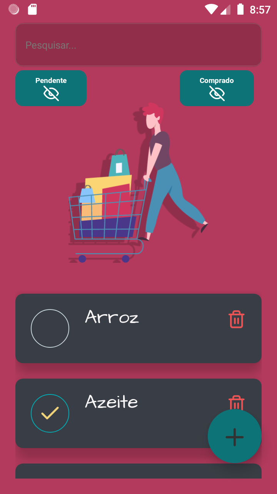

<h1 align="center">
  
  <br>
  Lista de Compras
  <br>
</h1>

<p align="center">Lista de Compras</p>

<br>

## 📅 Sobre

Aplicação para listar produtos comprados ou/e para comprar.

<p align="center">
  
  
</p>

## 🛠 Tecnologias
- [React Native](https://facebook.github.io/react-native/)
- [Javascript](https://devdocs.io/javascript/)
- [Node](https://nodejs.org/en/)
<br/>-
- [WatermelonDB](https://nozbe.github.io/WatermelonDB/)
- [react-native-vector-icon](https://www.npmjs.com/package/react-native-vector-icons)

*Foram usados outros Frameworks no projeto, mas esses são os principais.*

## 📱 Executando 

Para executar o projeto é necessário que você tenha o ambiente React Native configurado, você pode seguir esse [GUIA](https://reactnative.dev/docs/environment-setup) para tal.

Depois de configurar o ambiente, basta fazer o clone do projeto:

```sh
git clone https://github.com/JhonatanBergmann/lista-de-compras.git
```

Entre na pasta do projeto e execute o comando para instalar as dependências do projeto:

```sh
yarn install
```
ou
```sh
npm install
```

Em seguida execute o comando referente a plataforma ao qual deseja executar:

Android:

```sh
react-native run-android
```

iOS:

```sh
react-native run-ios
```

## 📝 Licença

Esse projeto está sob a licença MIT. Veja o arquivo [LICENSE](LICENSE) para mais detalhes.

---

<p align="center">
 Feito com 💜 by Jhonatan Bergmann
</p>

